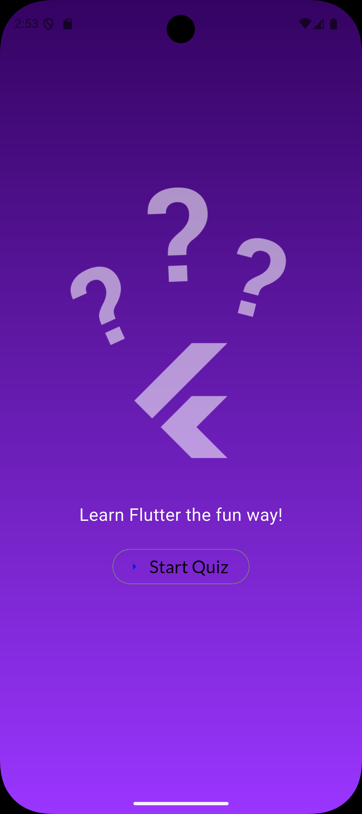
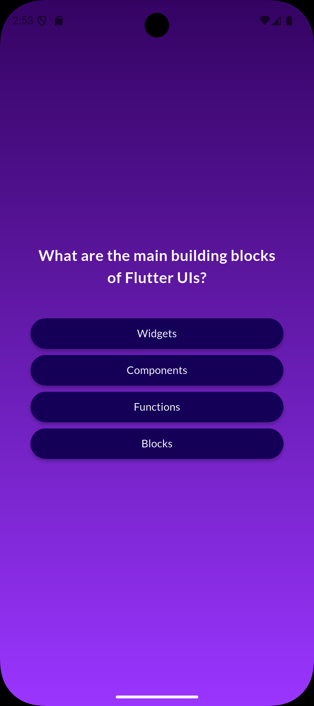
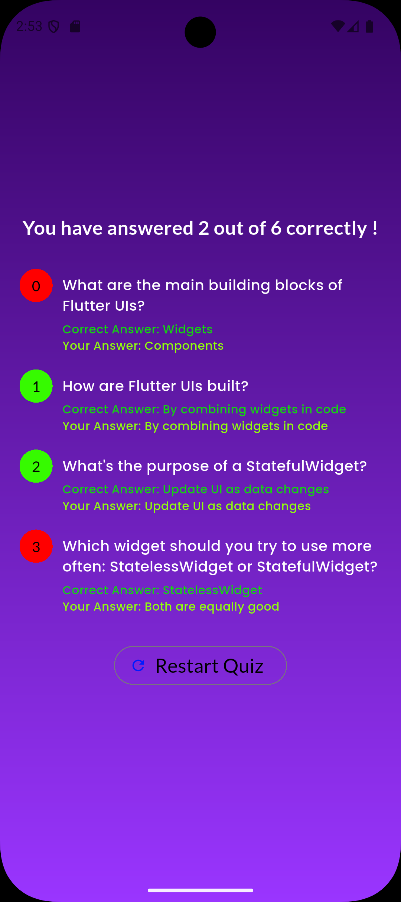
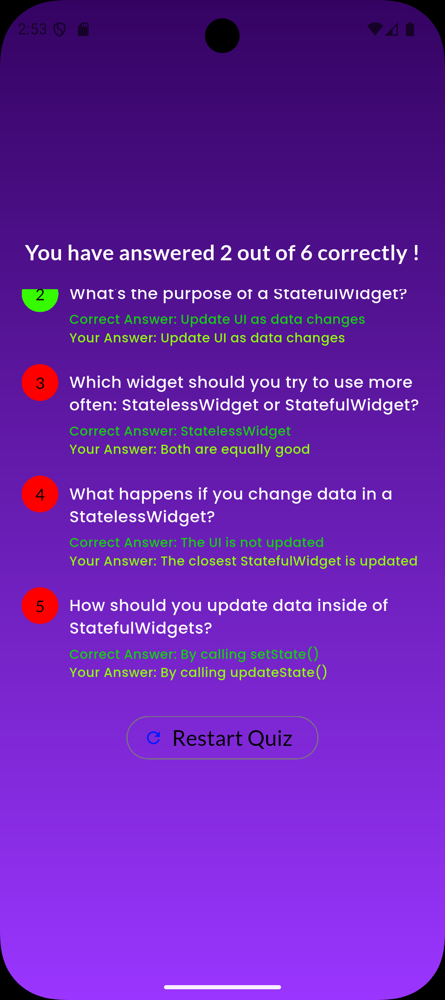

# Flutter Quiz App

```text
  ______ _       _   _              ____        _
 |  ____| |     | | | |            / __ \      (_)
 | |__  | |_   _| |_| |_ ___ _ __ | |  | |_   _ _ ____
 |  __| | | | | | __| __/ _ \ '__|| |  | | | | | |_  /
 | |    | | |_| | |_| ||  __/ |   | |__| | |_| | |/ /
 |_|    |_|\__,_|\__|\__\___|_|    \___\_\\__,_|_/___|
 ```

A dynamic and interactive Quiz application built with Flutter. This app tests the user's knowledge with a series of questions, tracks their answers, and provides a detailed summary of their performance.

## [::] Screenshots

| Start Screen | Quiz Question | Summary / Results |Summary / Results |
|:---:|:---:|:---:|:---:|
|  |  |  ||


## <*> Features

* **Interactive UI:** Smooth transitions and engaging user interface.
* **Real-time Logic:** Accurately tracks user input and compares it with correct answers.
* **Detailed Summary:** Displays a breakdown of every question, showing the **Correct Answer** vs. **Your Answer** with color-coded feedback (Green for correct, Red for wrong).
* **Custom Typography:** Utilizes `google_fonts` for a modern and clean look.
* **Responsive Layout:** Built to work seamlessly on different screen sizes.

## { / } Tech Stack

* **Framework:** [Flutter](https://flutter.dev/)
* **Language:** [Dart](https://dart.dev/)
* **Packages:**
    * [`google_fonts`](https://pub.dev/packages/google_fonts) - For typography.

## >_ Installation & Setup

Follow these steps to run the project locally.

1.  **Clone the repository:**
    ```bash
    git clone [https://github.com/Advaith-dev/flutter_quiz.git](https://github.com/Advaith-dev/flutter_quiz.git)
    ```

2.  **Navigate to the project directory:**
    ```bash
    cd flutter_quiz
    ```

3.  **Install dependencies:**
    ```bash
    flutter pub get
    ```

4.  **Run the app:**
    ```bash
    flutter run
    ```

## |--| Project Structure

```text
lib/
├── data/
│   └── questions.dart       # Contains the raw list of questions/answers
├── models/
│   └── quiz_questions.dart  # Data model defining the structure of a question
├── answer_button.dart       # Reusable widget for quiz answer options
├── gradient_custom.dart     # Custom background gradient styling
├── main.dart                # Entry point of the application
├── questions.dart           # Screen logic for displaying questions
├── quiz.dart                # State management handling screen switching
├── results_screen.dart      # Scrollable result view widget
├── start_page.dart          # The initial landing screen
└── summary_screen.dart      # The detailed results summary UI